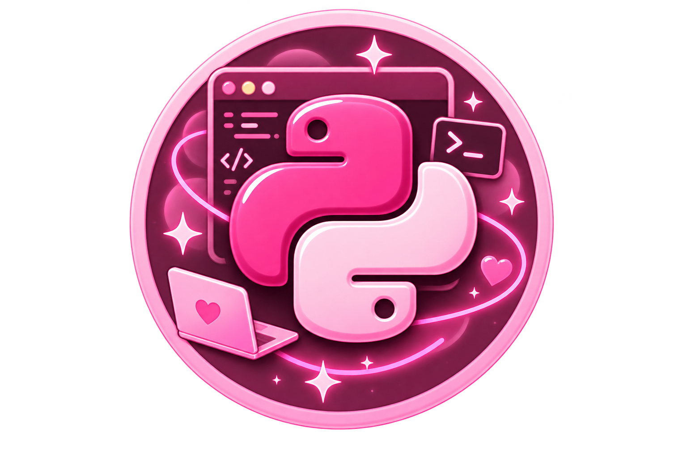

   <h1> Course Python<h1>

<p align="center">
  
  
  
</p>

<p align="center">
  <strong>Minha jornada de aprendizado em Python, do básico à construção de aplicações reais.</strong>
</p>

<p align="center">
  Este repositório documenta minha evolução prática em Python através de estudos,
  desafios, exercícios e projetos.
</p>

---


##  Sobre o projeto


> **Course-Python** é meu espaço de aprendizado e evolução na linguagem Python.

Aqui registro minha trajetória desde os primeiros conceitos de programação até conteúdos voltados para **desenvolvimento backend, APIs, automação, manipulação de dados e boas práticas de software**.
O objetivo não é apenas concluir um curso, mas transformar cada conteúdo estudado em **prática, código e projetos reais**.

```text
📚 Aprender
    ↓
💻 Praticar
    ↓
🧠 Entender
    ↓
🛠️ Construir
    ↓
🚀 Evoluir
```

---

## Objetivos

* [x] Começar os estudos em Python
* [x] Praticar lógica de programação
* [x] Aprender sintaxe e estruturas fundamentais
* [ ] Aprofundar Programação Orientada a Objetos
* [ ] Trabalhar com tratamento de exceções
* [ ] Aprender testes automatizados
* [ ] Trabalhar com APIs REST
* [ ] Utilizar bancos de dados com Python
* [ ] Desenvolver projetos backend
* [ ] Integrar Python com outras tecnologias
* [ ] Construir projetos para portfólio

---

# 📈 Minha evolução

A evolução está organizada por níveis para deixar claro o que estou aprendendo e onde quero chegar.

### 🟢 — Fundamentos

**Status:** Em desenvolvimento

* Variáveis e constantes
* Tipos de dados
* Entrada e saída de dados
* Operadores
* Condicionais
* `if / elif / else`
* Estruturas de repetição
* `for`
* `while`
* Funções
* Listas
* Tuplas
* Dicionários
* Sets

---

### 🔵  — Python Intermediário

**Status:** Próximo passo

* List comprehensions
* Funções avançadas
* `lambda`
* `map`, `filter` e `reduce`
* Manipulação de arquivos
* Módulos e pacotes
* Ambientes virtuais
* Gerenciamento de dependências
* Tratamento de exceções
* Expressões regulares

---

# 📂 Estrutura do repositório

```text
Course-Python/
│
├── 📚 fundamentos/
│   ├── variaveis/
│   ├── operadores/
│   ├── condicionais/
│   ├── loops/
│   └── funcoes/
│
├── 🧠 estruturas_de_dados/
│   ├── listas/
│   ├── tuplas/
│   ├── dicionarios/
│   └── sets/
│
├── 🏗️ poo/
│   ├── classes/
│   ├── heranca/
│   ├── encapsulamento/
│   └── polimorfismo/
│
├── 🛠️ exercicios/
│
├── 🚀 projetos/
│
└── README.md
```

---


# Tecnologias


| Tecnologia    | Utilização                |
| ------------- | ------------------------- |
| 🐍 Python     | Linguagem principal       |
| 🔀 Git        | Controle de versão        |
| 🐙 GitHub     | Versionamento e portfólio |
| 🗄️ SQL       | Banco de dados            |
| ⚡ FastAPI     | APIs REST                 |
| 🐘 PostgreSQL | Banco de dados            |
| 🐳 Docker     | Containerização           |

> As tecnologias serão adicionadas ao repositório conforme forem estudadas e utilizadas em projetos.

---


# 🚀 Projetos

# Projetos


A melhor forma de demonstrar evolução é através de projetos.

| Projeto                | Descrição                            | Status         |
| ---------------------- | ------------------------------------ | -------------- |
| 🧮 Calculadora         | Prática de lógica e operações        | 🔄 Em evolução |
| 📝 Sistema de tarefas  | CRUD e estruturas de dados           | ⏳ Planejado    |
| 💰 API Financeira      | Backend para controle financeiro     | ⏳ Planejado    |
| 🔎 API de produtos     | Consulta e gerenciamento de produtos | ⏳ Planejado    |
| 📊 Analisador de dados | Manipulação e análise de dados       | ⏳ Planejado    |

---


# 📊 Progresso

#  Progresso
```text
Python Fundamentals     ███████░░░  70%
Data Structures         ████░░░░░░  40%
Object-Oriented Python  ██░░░░░░░░  20%
APIs & Backend          █░░░░░░░░░  10%
Testing                 ░░░░░░░░░░   0%
Docker                  ░░░░░░░░░░   0%
```

> Os indicadores serão atualizados conforme avanço nos estudos e projetos.

---

# Metodologia de estudo

# Metodologia de estudo

Meu aprendizado é baseado em **prática + construção de projetos**.

```text
📖 Teoria
   ↓
⌨️ Exercícios
   ↓
🐛 Debugging
   ↓
🧪 Testes
   ↓
🛠️ Projeto
   ↓
🔎 Refatoração
   ↓
🚀 Portfólio
```

A cada novo conceito, busco entender:

**Como funciona? → Por que funciona? → Quando utilizar? → Como aplicar em um projeto real?**

---

# 🌱 O que este repositório representa

Este projeto não é apenas uma coleção de códigos.

É um registro da minha evolução como **estudante de Engenharia de Software e futura desenvolvedora backend**.

Cada commit representa um pequeno avanço.

Cada erro representa algo aprendido.

Cada projeto representa um novo nível de autonomia.

> **Código que hoje parece difícil pode se tornar uma ferramenta que amanhã sei construir.**

---


# Sobre mim


Sou estudante de **Engenharia de Software**, com foco em desenvolvimento backend e interesse em construir sistemas, APIs e soluções utilizando boas práticas de engenharia de software.
Atualmente, estou expandindo meus conhecimentos em diferentes tecnologias e utilizando projetos práticos para transformar conhecimento teórico em experiência.

### Atualmente estudando

```text
Java
Spring Boot
Python
APIs REST
Banco de Dados
Git & GitHub
Engenharia de Software
```

---

## 🔗 Conecte-se comigo

<p align="center">

<a href="https://github.com/ElzaDevs">
  
</a>

</p>

---

<p align="center">
  <strong>🐍 Em construção, um commit de cada vez.</strong>
</p>

<p align="center">
  <sub>Course-Python • Learning by building • 2026</sub>
</p>
